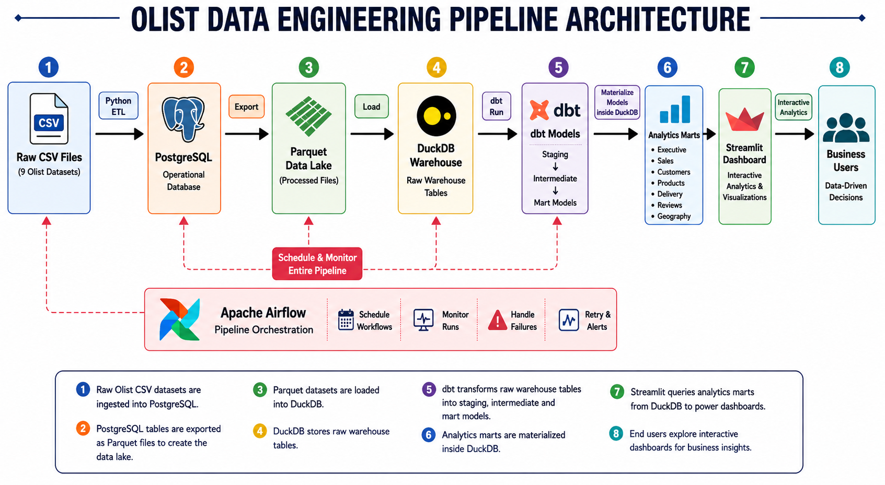

# Olist Data Engineering Pipeline

> **An End-to-End Data Engineering Portfolio Project** built using **PostgreSQL, Parquet, DuckDB, dbt, Apache Airflow, Streamlit, and Docker**.

<p align="center">


</p>

---

# Project Overview

This project demonstrates the design and implementation of a complete **modern Data Engineering pipeline** using the **Brazilian Olist E-Commerce Dataset**.

Rather than focusing on a single technology, this project covers the complete analytics lifecycle—from raw data ingestion to interactive business dashboards—following modern data engineering practices.

The pipeline consists of:

- PostgreSQL as the operational database
- Parquet as the Data Lake layer
- DuckDB as the Analytics Warehouse
- dbt for data transformation
- Apache Airflow for orchestration
- Streamlit for business intelligence dashboards
- Automated testing using Pytest

The objective is to simulate a production-style analytics platform while showcasing practical Data Engineering skills commonly used in industry.

---

# Key Features

- End-to-End ETL Pipeline
- PostgreSQL Operational Database
- Parquet Data Lake
- DuckDB Analytics Warehouse
- dbt Data Transformations
- Apache Airflow Pipeline Orchestration
- Interactive Streamlit Dashboards
- Automated Data Validation
- Automated Pipeline Testing
- Modern Modular Project Structure
- Docker Containerization

---

# Pipeline Architecture

<p align="center">
    <a href="docs/screenshots/architecture.png">
        
    </a>
</p>

---

# Pipeline Flow

The complete analytics workflow consists of the following stages:

1. Raw Olist CSV datasets are ingested into PostgreSQL.
2. PostgreSQL tables are exported into Parquet files to create the Data Lake.
3. Parquet datasets are loaded into the DuckDB analytics warehouse.
4. dbt transforms raw warehouse tables into staging, intermediate, and mart models.
5. Apache Airflow orchestrates the complete pipeline execution.
6. Streamlit queries the analytics marts stored in DuckDB.
7. Business users explore interactive dashboards for data-driven decision making.

---

# Technology Stack

| Category | Technology |
|-----------|------------|
| Programming Language | Python 3.10 |
| Database | PostgreSQL 16 |
| Data Lake | Apache Parquet |
| Analytics Warehouse | DuckDB |
| Data Transformation | dbt |
| Workflow Orchestration | Apache Airflow |
| Dashboard | Streamlit |
| Visualization | Plotly |
| Containerization | Docker & Docker Compose |
| Testing | Pytest |
| Version Control | Git & GitHub |

---

# System Architecture

| Layer | Technology | Purpose |
|--------|------------|---------|
| Raw Data | CSV | Source datasets |
| Operational Database | PostgreSQL | Initial data storage |
| Data Lake | Parquet | Intermediate storage |
| Analytics Warehouse | DuckDB | Analytical querying |
| Transformation Layer | dbt | Data modeling |
| Orchestration | Apache Airflow | Pipeline automation |
| Business Intelligence | Streamlit | Interactive dashboards |

---

# Project Structure

```text
olist-data-engineering-pipeline/

├── dags/                      # Apache Airflow DAGs
│   └── olist_pipeline.py
│
├── dashboard/                 # Streamlit analytics dashboards
│   ├── Home.py
│   ├── pages/
│   │   ├── Executive
│   │   ├── Sales
│   │   ├── Customers
│   │   ├── Products
│   │   ├── Delivery
│   │   ├── Reviews
│   │   └── Geography
│   ├── assets/
│   ├── components.py
│   ├── theme.py
│   └── utils.py
│
├── data/
│   ├── raw/                   # Raw Olist CSV datasets
│   └── processed/             # Parquet Data Lake
│
├── dbt_olist/
│   ├── models/
│   │   ├── staging/
│   │   ├── intermediate/
│   │   └── marts/
│   ├── macros/
│   ├── snapshots/
│   ├── seeds/
│   └── dbt_project.yml
│
├── docs/                      # Reports & documentation
│
├── notes/                     # Development notes by project phase
│
├── scripts/
│   ├── ingestion/             # CSV → PostgreSQL
│   ├── export/                # PostgreSQL → Parquet
│   ├── warehouse/             # Parquet → DuckDB
│   └── utilities/             # Download, profiling & key validation
│
├── sql/
│   └── create_olist_tables.sql
│
├── tests/                     # Automated testing
│
├── warehouse/
│   └── olist.duckdb
│
├── Dockerfile
├── docker-compose.yml
├── requirements.txt
└── README.md
```

---

# Pipeline Components

| Component | Description |
|-----------|-------------|
| **download_dataset.py** | Downloads the Brazilian Olist dataset into the raw data directory. |
| **profile_dataset.py** | Profiles raw datasets by analysing row counts, data types, missing values, and dataset structure before ingestion. |
| **verify_keys.py** | Validates primary keys, foreign keys, duplicates, and referential integrity before loading data into PostgreSQL. |
| **ingest_postgres.py** | Performs batch ingestion of raw CSV datasets into PostgreSQL with idempotent loading using table truncation. |
| **export_parquet.py** | Exports PostgreSQL tables into Parquet format to build the Data Lake layer. |
| **load_duckdb.py** | Loads Parquet datasets into the DuckDB analytics warehouse. |
| **dbt Models** | Transforms raw warehouse tables into staging, intermediate, and analytics mart models. |
| **olist_pipeline.py** | Apache Airflow DAG that orchestrates the complete end-to-end data engineering workflow. |

---

# Testing & Data Quality

The project includes automated testing to validate each stage of the data engineering pipeline, ensuring data integrity, consistency, and correctness from ingestion to analytics.

## Test Coverage

| Test Suite | Purpose | Status |
|------------|---------|--------|
| **test_ingestion.py** | Validate raw datasets and PostgreSQL ingestion | ✅ Passed |
| **test_export_parquet.py** | Validate Parquet Data Lake export | ✅ Passed |
| **test_load_duckdb.py** | Validate DuckDB warehouse loading | ✅ Passed |
| **test_pipeline.py** | Validate end-to-end analytics pipeline | ✅ Passed |

### Validation Includes

- Dataset configuration
- Raw dataset availability
- CSV loading
- Required column validation
- Primary & foreign key validation
- PostgreSQL ingestion
- Parquet export
- DuckDB warehouse loading
- Analytics mart validation
- Revenue validation
- Duplicate detection
- Referential integrity validation
- NULL value validation

## Test Summary

| Metric | Result |
|--------|--------|
| Test Suites | **4** |
| Automated Tests | **28** |
| Passed | **28** |
| Failed | **0** |
| Success Rate | **100%** |

Detailed test reports are available under:

```text
docs/testing/
```

---

# Project Documentation

The project is fully documented from planning through deployment.

## Development Notes

| Phase | Description |
|--------|-------------|
| 00 | Project Planning |
| 01 | Project Setup |
| 02 | PostgreSQL Data Ingestion |
| 03 | Parquet Data Lake |
| 04 | DuckDB Data Warehouse |
| 05 | dbt Transformations |
| 06 | Apache Airflow Orchestration |
| 07 | Streamlit Analytics Dashboard |
| 08 | Testing & Data Quality |
| 09 | Documentation & Deployment |

## Technical Reports

The `docs/` directory contains additional technical reports, including:

- Data Profiling Report
- Primary & Foreign Key Validation Report
- Parquet Export Report
- DuckDB Load Report
- Pipeline Documentation
- Testing Reports

---

# Getting Started

## 1. Clone the Repository

```bash
git clone https://github.com/KHakim96/olist-data-engineering-pipeline.git

cd olist-data-engineering-pipeline
```

---

## 2. Start Docker Services

```bash
docker compose up -d
```

---

## 3. Install Python Dependencies

```bash
pip install -r requirements.txt
```

---

# ▶️ Running the Pipeline

### Ingest Raw Data into PostgreSQL

```bash
python -m scripts.ingestion.ingest_postgres
```

---

### Export PostgreSQL to Parquet

```bash
python -m scripts.export.export_parquet
```

---

### Load Parquet into DuckDB

```bash
python -m scripts.warehouse.load_duckdb
```

---

### Execute dbt Transformations

```bash
cd dbt_olist

dbt run
```

---

### Launch Streamlit Dashboard

```bash
streamlit run dashboard/Home.py
```

---

### Run Apache Airflow

Open your browser:

```
http://localhost:8080
```

Trigger the DAG:

```
olist_data_engineering_pipeline
```

---

# Analytics Dashboards

The Streamlit application contains seven interactive business dashboards.

| Dashboard | Description |
|-----------|-------------|
| 📈 Executive | Executive KPIs and business overview |
| 💰 Sales | Revenue and sales performance analysis |
| 👥 Customers | Customer behaviour and purchasing insights |
| 📦 Products | Product category and performance analysis |
| 🚚 Delivery | Delivery performance and logistics |
| ⭐ Reviews | Customer satisfaction and review analysis |
| 🌎 Geography | Revenue, orders, and customer distribution across Brazil |

# Live Demo

The interactive Streamlit application can be accessed here:

> **Coming Soon**

The deployed application includes:

- 📈 Executive Dashboard
- 💰 Sales Dashboard
- 👥 Customers Dashboard
- 📦 Products Dashboard
- 🚚 Delivery Dashboard
- ⭐ Reviews Dashboard
- 🌎 Geography Dashboard

---

# Future Improvements

Potential enhancements include:

- GitHub Actions CI pipeline
- Streamlit Cloud deployment
- Additional dashboard visualisations
- Enhanced data quality monitoring
- Incremental dbt models
- Performance optimisation
- Improved dashboard filtering and drill-down capabilities

---

# License

This project is licensed under the **MIT License**.

See the [LICENSE](LICENSE) file for more information.

---

# Author

**Luqman Hakim**

Data Engineer | Malaysia

GitHub

https://github.com/KHakim96

---

# Acknowledgements

This project was built using the following open-source technologies:

- Olist Brazilian E-Commerce Dataset
- Python
- PostgreSQL
- Apache Parquet
- DuckDB
- dbt
- Apache Airflow
- Streamlit
- Plotly
- Docker
- Pytest

Thank You!